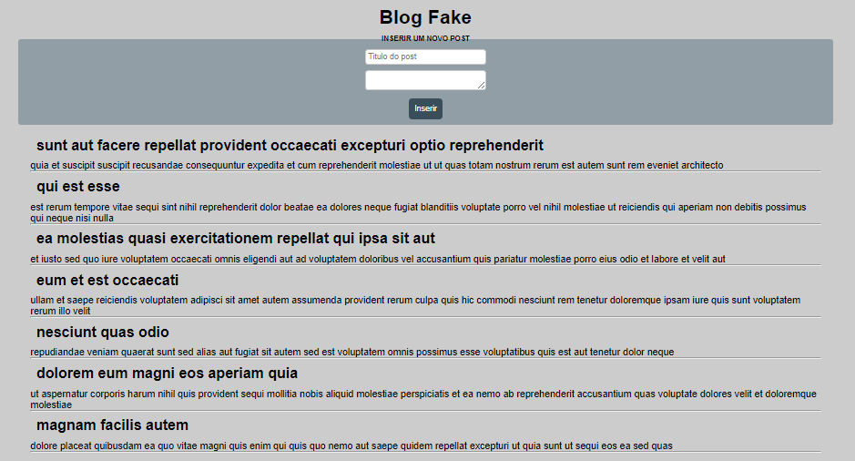

# Blog Fake
> site teste de requisições 

Projeto construído como exercício do curso da B7web
> finalizado 

link da requisição: //https://jsonplaceholder.typicode.com/posts

[Clique aqui para acessar](https://rafael-damasceno.github.io/Blog-Fake/)

## Tecnologias:

- HTML
- CSS
- Git e Github
- JavaScript

### Aprendido:

- Json
- Sicronismo 
- Async/await 
- Try and catch
- Fetch 
- Method: GET POST PUT DELETE
